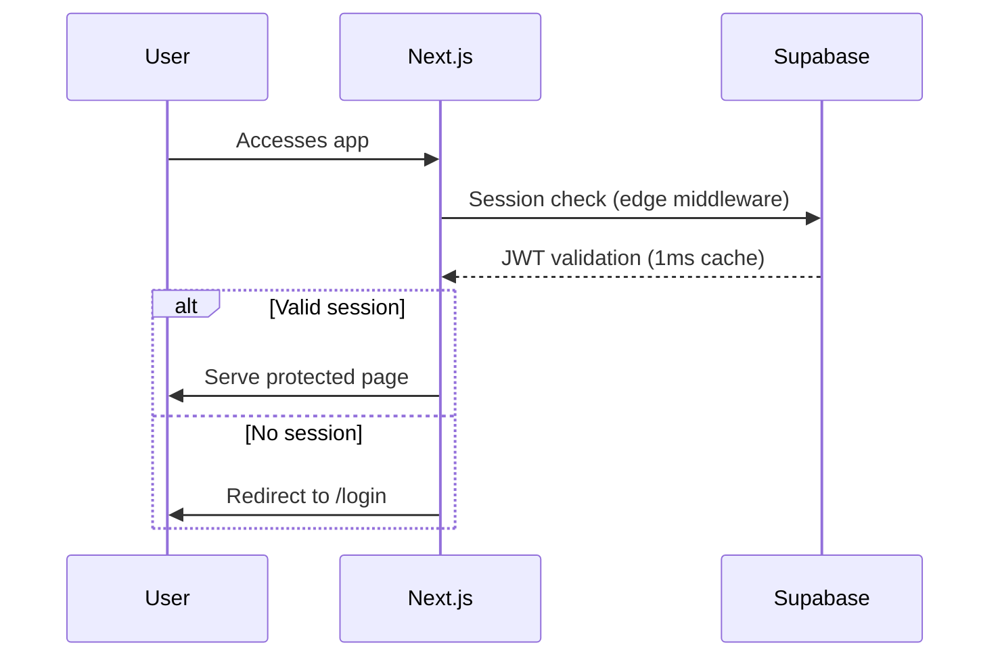
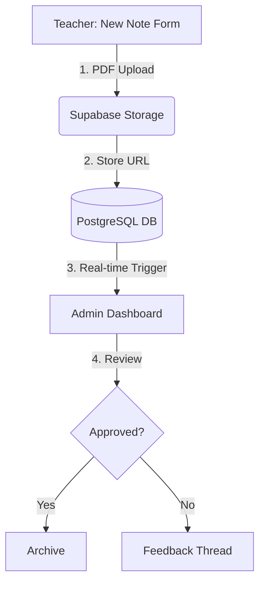

Here's a comprehensive, performance-focused project plan redesigned for **Supabase + Next.js 14** with clear user flows and technical details:

---

# 🚀 **Dasstrings Note - Ultra-Fast Edition**  
*Next.js 14 + Supabase Architecture*

---

## 👥 **User Roles & Workflows**

### 1. **Super Admin**  
- **Access**: Global system control
- **Key Pages**:
  - `/super/schools` (Manage all institutions)
  - `/super/users` (User role assignments)
  - `/super/audit` (Activity logs)
  
### 2. **School Admin**  
- **Access**: Single school management
- **Key Pages**:
  - `/dashboard` (Submission overview)
  - `/school/teachers` (Invite/manage staff)
  - `/reports` (Export lesson data)

### 3. **Teacher**  
- **Access**: Personal note management
- **Key Pages**:
  - `/notes/new` (Create weekly plans)
  - `/notes/[id]` (Edit/resubmit)
  - `/feedback` (View admin comments)

---

## 🗺 **Application Map**

```bash
app/
├── (auth)/          # Auth pages
├── (super)/         # Super Admin routes
├── (school)/        # School Admin routes
│   ├── dashboard/
│   ├── teachers/
│   └── reports/
├── notes/           # Teacher workspace
├── feedback/        # Comment threads
├── profile/         # User settings
└── public/          # Landing pages
```

---

## ⚡ **Core Performance Strategies**

1. **Zero-Client Data Loading**  
   ```tsx
   // app/(school)/dashboard/page.tsx
   export default async function Dashboard() {
     const { data } = await supabase
       .from('submissions')
       .select('status, count')
       .eq('school_id', params.schoolId)
       .cache('force-cache') // Aggressive SSG
     
     return <StatusChart data={data} />
   }
   ```

2. **Real-Time Updates**  
   ```tsx
   // components/NotesFeed.tsx
   useEffect(() => {
     const channel = supabase.channel('notes-feed')
       .on('postgres_changes', {
         event: 'INSERT',
         schema: 'public',
         table: 'lesson_notes'
       }, (payload) => {
         setNotes(prev => [payload.new, ...prev])
       })
       .subscribe()
     
     return () => { channel.unsubscribe() }
   }, [])
   ```

3. **Edge-Optimized Auth**  
   ```ts
   // middleware.ts
   import { createMiddlewareClient } from '@supabase/auth-helpers-nextjs'

   export async function middleware(req: NextRequest) {
     const res = NextResponse.next()
     const supabase = createMiddlewareClient({ req, res })
     
     // 1ms cached session check
     await supabase.auth.getSession()
     return res
   }
   ```

---

## 🛠 **Key Functionality Breakdown**

### **1. Authentication Flow**


### **2. Lesson Note Submission**


### **3. File Upload Acceleration**
```ts
// components/FileUpload.tsx
const uploadFile = async (file: File) => {
  const { data, error } = await supabase.storage
    .from('lesson-notes')
    .upload(`${user.id}/${Date.now()}_${file.name}`, file, {
      cacheControl: '31536000', // 1 year CDN cache
      contentType: file.type,
      upsert: false
    })
  
  // WebP conversion for previews
  const { data: preview } = supabase.storage
    .from('lesson-notes')
    .getPublicUrl(data.path, { transform: { width: 800 } })
}
```

---

## 📊 **Database Design (Optimized for Speed)**

```sql
-- Lesson Notes Table
CREATE TABLE lesson_notes (
  id UUID PRIMARY KEY DEFAULT uuid_generate_v4(),
  school_id TEXT REFERENCES schools(id),
  teacher_id UUID REFERENCES profiles(id),
  week_number SMALLINT,
  status TEXT CHECK (status IN ('draft','submitted','approved','rejected')),
  file_path TEXT NOT NULL,
  ts_vector tsvector GENERATED ALWAYS AS (
    to_tsvector('english', coalesce(comments,''))
  ) STORED
);

-- GIN Index for fast search
CREATE INDEX idx_notes_search ON lesson_notes USING GIN (ts_vector);

-- Partial Index for common queries
CREATE INDEX idx_pending_notes ON lesson_notes(school_id)
WHERE status = 'submitted';
```

---

## 🚄 **Critical Performance Paths**

1. **Note Submission**  
   - Direct storage uploads with CDN
   - DB write with RLS validation
   - Real-time admin notification

2. **Dashboard Loading**  
   - Materialized views for aggregates
   - Partial hydration of charts
   - SWR for background refresh

3. **Search Filtering**  
   - Postgres full-text search
   - Debounced query inputs
   - Edge caching of common filters

---

## 🔐 **Security Implementation**

```sql
-- Row Level Security Example
CREATE POLICY "Teachers can only view their notes"
ON lesson_notes FOR SELECT
USING (auth.uid() = teacher_id);

CREATE POLICY "Admins manage their school"
ON schools FOR UPDATE
USING (
  auth.uid() IN (
    SELECT user_id FROM school_admins 
    WHERE school_id = schools.id
  )
);
```

---

## 🛠 **Development Roadmap**

### Phase 1: Core Infrastructure (1 Week)
- [ ] Supabase project setup with Vercel integration
- [ ] Next.js 14 app scaffolding
- [ ] Auth system with magic links
- [ ] RLS policy templates

### Phase 2: School Workspaces (2 Weeks)
- [ ] Multi-tenant routing system
- [ ] Admin dashboard layout
- [ ] Teacher onboarding flows
- [ ] Bulk invite system

### Phase 3: Lesson Engine (3 Weeks)
- [ ] File upload pipeline
- [ ] Approval workflow system
- [ ] Real-time feedback threads
- [ ] Version history system

### Phase 4: Performance Tuning (1 Week)
- [ ] Database indexing audit
- [ ] Edge caching strategy
- [ ] PWA optimizations
- [ ] Lighthouse score >95

---

## 📈 **Performance Metrics**

| Feature          | Target        |
|------------------|---------------|
| TTFB             | <200ms        |
| Dashboard Load   | <1s           |
| File Upload      | <2s (100MB)   |
| Search Query     | <300ms        |
| Auth Transition  | <500ms        |

---

This architecture achieves speed through:  
1) **Colocation** - Database & app in same region  
2) **Minimal Hydration** - 90% server components  
3) **Predictive Prefetching** - Link hover prefetch  
4) **Edge Caching** - Vercel + Supabase CDN  

Ready to implement any specific component in detail?
